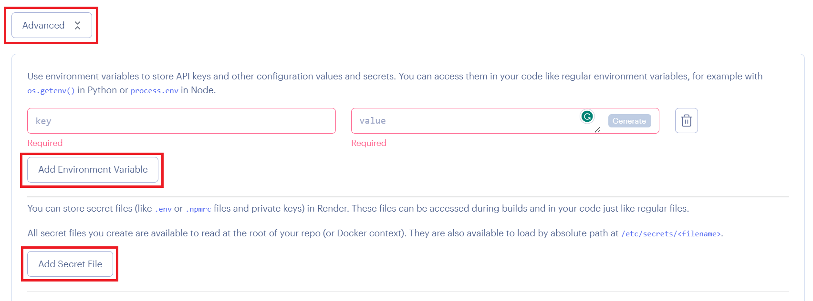

# Deploy a NodeJS application with Render

This guide will walk you through the process of deploying a NodeJS application in the [cloud][cloud]. You will use [Render][render], a [Platform-as-a-Service][paas] cloud, to run your application;

<!-- START doctoc generated TOC please keep comment here to allow auto update -->
<!-- DON'T EDIT THIS SECTION, INSTEAD RE-RUN doctoc TO UPDATE -->

- [Requirements](#requirements)
- [Create and Push to a Git repository](#create-and-push-to-a-git-repository)
- [Deploy to Render](#deploy-to-render)

<!-- END doctoc generated TOC please keep comment here to allow auto update -->

## Requirements

- [Node.js][node]
- [Git][git]
- A [GitHub][github] account
- A [Render][render] account

## Create and Push to a Git repository

To deploy code on Render, you will need to use [Git][git].

Register a [GitHub][github] account if you haven't already.

Add a `.gitignore` file to ignore the `node_modules` directory (dependencies
will be automatically installed by Render when you push), `package-lock.json` file and `.env` file (if you have an .env file):

The contents of your `.gitignore` file should look like this:

```txt
/node_modules
package-lock.json
# add this if you have an .env file
.env
```

Create a **private** repository on GitHub.

Initialize a Git repository in the application's directory:

```bash
$> git init
```

Commit all the app's files:

```bash
$> git add .
$> git commit -m "Initial commit"
```

Create `main` branch:

```bash
$> git branch -M main
```

Add a new remote repository to your local Git repository:

```bash
$> git remote add origin git@github.com:your-github-username/your-repo-name.git
```

Push to GitHub:

```bash
$> git push -u origin main
```

## Deploy to Render

Register a [Render][render] account if you haven't already.

If you register through GitHub, you will not have to link the two accounts together later.


Go to your dashboard and create a new Web Service:


Connect your GitHub repository to Render by selecting the one the contains your app from the list.


If you can't see your repositories, click on `Configure account` and link your GitHub account to Render.


Name the application, choose the region and enter the commands used to build and start your app. The branch name should automatically be set to "main" or "master", depending on how your repository is setup.


Select the `free plan`.


Click on `Advanced`, if you need to set an environment variables.


Add your `Key` `Value` variables



You can copy your `.env` file by clicking on `Add Secret File`, **remember not to copy your `PORT` variable**


Once you are ready, click on `Create Web Service`


Once you submit the form, Render will automatically try to deploy your app. You will be able to see live logs.

Pretty cool, but be aware that deploys on the free plan can take a little while. Be patient.


The deployment process should eventually succeed. But... **Oh no there seems to be a some weird error in the logs!** Think about it for a second. What could've gone wrong?

```bash
2020-09-13T09:46:13.394704+00:00 app[web.1]: (node:23) UnhandledPromiseRejectionWarning: MongoNetworkError: failed to connect to server [localhost:27017] on first connect [Error: connect ECONNREFUSED 127.0.0.1:27017
2020-09-13T09:46:13.394707+00:00 app[web.1]: at TCPConnectWrap.afterConnect [as oncomplete] (net.js:1141:16) {
2020-09-13T09:46:13.394708+00:00 app[web.1]: name: 'MongoNetworkError'
2020-09-13T09:46:13.394709+00:00 app[web.1]: }]
2020-09-13T09:46:13.394710+00:00 app[web.1]: at Pool.<anonymous> (/app/node_modules/mongodb/lib/core/topologies/server.js:438:11)
2020-09-13T09:46:13.394711+00:00 app[web.1]: at Pool.emit (events.js:315:20)
2020-09-13T09:46:13.394712+00:00 app[web.1]: at /app/node_modules/mongodb/lib/core/connection/pool.js:562:14
2020-09-13T09:46:13.394712+00:00 app[web.1]: at /app/node_modules/mongodb/lib/core/connection/pool.js:995:11
2020-09-13T09:46:13.394712+00:00 app[web.1]: at /app/node_modules/mongodb/lib/core/connection/connect.js:32:7
2020-09-13T09:46:13.394713+00:00 app[web.1]: at callback (/app/node_modules/mongodb/lib/core/connection/connect.js:280:5)
2020-09-13T09:46:13.394713+00:00 app[web.1]: at Socket.<anonymous> (/app/node_modules/mongodb/lib/core/connection/connect.js:310:7)
2020-09-13T09:46:13.394714+00:00 app[web.1]: at Object.onceWrapper (events.js:422:26)
2020-09-13T09:46:13.394714+00:00 app[web.1]: at Socket.emit (events.js:315:20)
2020-09-13T09:46:13.394715+00:00 app[web.1]: at emitErrorNT (internal/streams/destroy.js:92:8)
2020-09-13T09:46:13.394716+00:00 app[web.1]: at emitErrorAndCloseNT (internal/streams/destroy.js:60:3)
2020-09-13T09:46:13.394716+00:00 app[web.1]: at processTicksAndRejections (internal/process/task_queues.js:84:21)
```

Once your deploy is live, you should be able to test your API at the URL generated by Render. It should look something like: `https://app_name-4vxg.onrender.com`


You can set the environment variables by clilking on `Environment`


And you can deploy again


🎉

[cloud]: https://en.wikipedia.org/wiki/Cloud_computing
[express]: https://expressjs.com
[express-generator]: https://www.npmjs.com/package/generator-express-api-es
[git]: https://git-scm.com
[github]: https://github.com
[render]: https://render.com
[mongodb-atlas]: https://www.mongodb.com/cloud/atlas
[mongodb-try]: https://www.mongodb.com/try
[mongoose]: https://mongoosejs.com
[node]: https://nodejs.org
[paas]: https://en.wikipedia.org/wiki/Platform_as_a_service
[two-hard-things]: https://martinfowler.com/bliki/TwoHardThings.html
